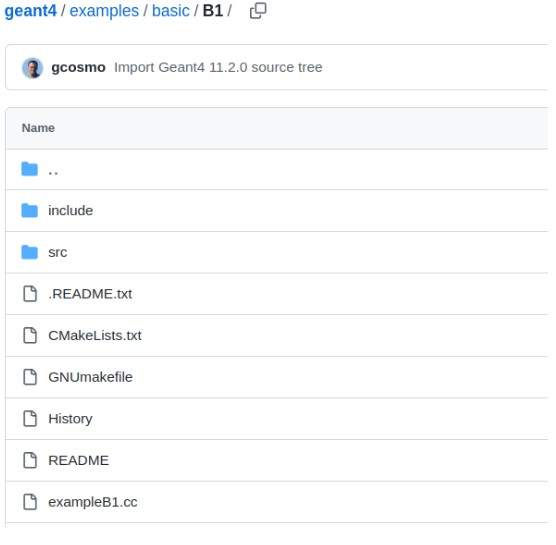
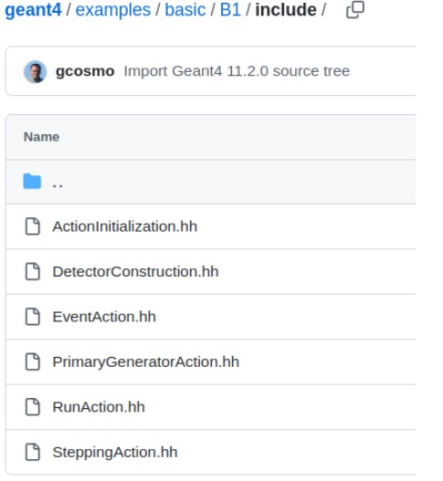
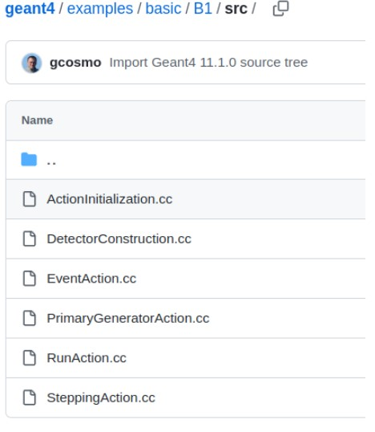
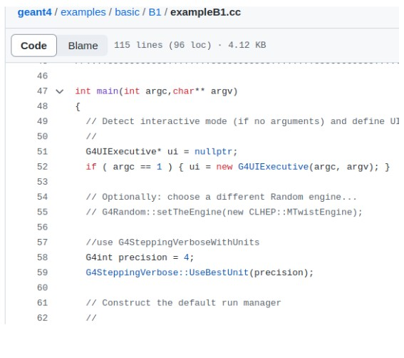
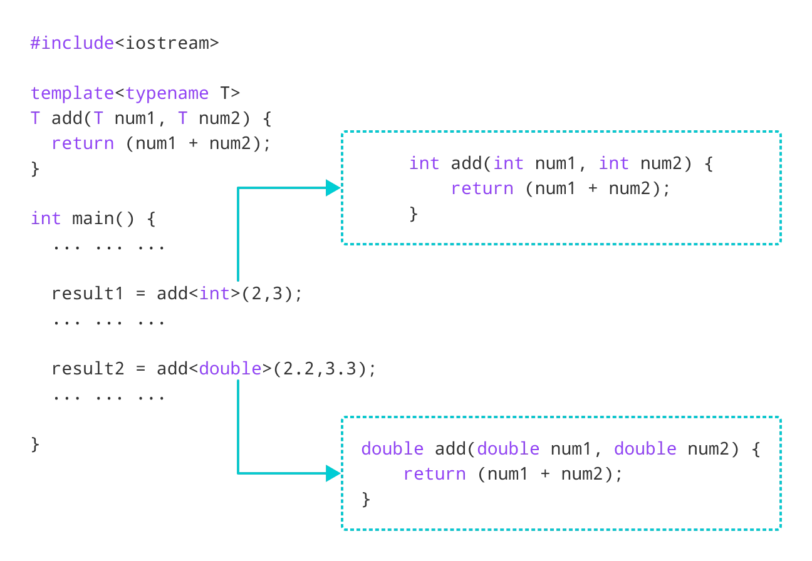

# **C++ and Geant4**

EHEP Software School 2024
```29 Jan - 10 Feb 2024```

```Deepak Samuel```

https://github.com/deepaksamuel/ehep-student-codes.git

---
# C++ code structure


<div class="columns">
<div>


- ```Class definitions``` in header files (.h, .hh extensions) kept in ```include``` folder for g4 programmes
- ```Class method``` implementations in source files (.cc, .cpp, .cxx extensions)
kept in ```src``` folder for g4 programmes
- A source file with a ```main function``` where the programme starts 

- a ```CMakeLists.txt``` file

</div>
<div>




</div>
</div>


---

# ```include``` folder


<div class="columns">
<div>


- ```Class definitions``` in header files (.h, .hh extensions) kept in ```include``` folder for g4 programmes
- ```Class method``` implementations in source files (.cc, .cpp, .cxx extensions)
kept in ```src``` folder for g4 programmes
- A source file with a ```main function``` where the programme starts 

- a ```CMakeLists.txt``` file

</div>
<div>




</div>
</div>

---
# ```src``` folder  


<div class="columns">
<div>


- ```Class definitions``` in header files (.h, .hh extensions) kept in ```include``` folder for g4 programmes
- ```Class method``` implementations in source files (.cc, .cpp, .cxx extensions)
kept in ```src``` folder for g4 programmes
- A source file with a ```main function``` where the programme starts 

- a ```CMakeLists.txt``` file

</div>
<div>




</div>
</div>

---

# ```main``` function


<div class="columns">
<div>


- ```Class definitions``` in header files (.h, .hh extensions) kept in ```include``` folder for g4 programmes
- ```Class method``` implementations in source files (.cc, .cpp, .cxx extensions)
kept in ```src``` folder for g4 programmes
- A source file with a ```main function``` where the programme starts 

- a ```CMakeLists.txt``` file

</div>
<div>




</div>
</div>

---

# ```DetectorConstruction``` class

<div class="columns">
<div>

###### B1DetectorConstruction.hh
```c
class DetectorConstruction : public G4VUserDetectorConstruction
{
  public:
    DetectorConstruction() = default;
    ~DetectorConstruction() override = default;

    G4VPhysicalVolume* Construct() override;

    G4LogicalVolume* GetScoringVolume() const { return fScoringVolume; }

  protected:
    G4LogicalVolume* fScoringVolume = nullptr;
};

```
Notice V in `G4VUserDetectorConstruction` 
Indicates  an abstract class:
> Virtual methods to be overridden by inherited classes.
</div>

<div>

##### G4VUserDetectorConstruction.hh
```c
class G4VUserDetectorConstruction
{
  public:
    G4VUserDetectorConstruction();
    virtual ~G4VUserDetectorConstruction();

  public:
    virtual G4VPhysicalVolume* Construct() = 0;
    virtual void ConstructSDandField();
    virtual void CloneSD();
  public:
    void RegisterParallelWorld(G4VUserParallelWorld*);

  public:
    G4int ConstructParallelGeometries();
    void ConstructParallelSD();
  private:
    std::vector<G4VUserParallelWorld*> parallelWorld;
  public:
    G4int GetNumberOfParallelWorld() const;
    G4VUserParallelWorld* GetParallelWorld(G4int i) const;

  protected:
    void SetSensitiveDetector(const G4String& logVolName,
                G4VSensitiveDetector* aSD,G4bool multi=false);

};
```

</div>
</div>

---


# ```DetectorConstruction``` class

<div class="columns">
<div>

###### B1DetectorConstruction.hh
```c
class DetectorConstruction : public G4VUserDetectorConstruction
{
  public:
    DetectorConstruction() = default;
    ~DetectorConstruction() override = default;

    G4VPhysicalVolume* Construct() override;

    G4LogicalVolume* GetScoringVolume() const { return fScoringVolume; }

  protected:
    G4LogicalVolume* fScoringVolume = nullptr;
};

```

</div>

<div>

-   `DetectorConstruction` inherits  `G4VUserDetectorConstruction`
- *Geant4*:  **Parent/Base class**
  - `G4VUserDetectorConstruction`
- *You*:  **Subclass**
  - `DetectorConstruction`
- `subclassing`: use/override methods and variables of the parent class

</div>
</div>

---

# ```DetectorConstruction``` class

<div class="columns">
<div>

###### B1DetectorConstruction.hh
```c
class DetectorConstruction : public G4VUserDetectorConstruction
{
  public:
    DetectorConstruction() = default;
    ~DetectorConstruction() override = default;

    G4VPhysicalVolume* Construct() override;

    G4LogicalVolume* GetScoringVolume() const { return fScoringVolume; }

  protected:
    G4LogicalVolume* fScoringVolume = nullptr;
};

```
</div>

<div>

  
- ```Methods``` have brackets, ```variables``` don't

- ```Constructor```: same name as the class
- ```Destructor```: has a ~ in front


</div>
</div>


---


# ```DetectorConstruction``` class

<div class="columns">
<div>

###### B1DetectorConstruction.hh

```c
class DetectorConstruction : public G4VUserDetectorConstruction
{
  public:
    DetectorConstruction() = default;
    ~DetectorConstruction() override = default;

    G4VPhysicalVolume* Construct() override;

    G4LogicalVolume* GetScoringVolume() const { return fScoringVolume; }

  protected:
    G4LogicalVolume* fScoringVolume = nullptr;
};

```
The Construct ```(virtual)``` method is overridden by the user. 
</div>

<div>

###### B1DetectorConstruction.cc

```c
G4VPhysicalVolume* DetectorConstruction::Construct()
{
  // Get nist material manager
  G4NistManager* nist = G4NistManager::Instance();

  // Envelope parameters
  //
  G4double env_sizeXY = 20*cm, env_sizeZ = 30*cm;
  G4Material* env_mat = nist->FindOrBuildMaterial("G4_WATER");

  // Option to switch on/off checking of volumes overlaps
  //
  G4bool checkOverlaps = true;

  //
  // World
  //
  G4double world_sizeXY = 1.2*env_sizeXY;
  G4double world_sizeZ  = 1.2*env_sizeZ;
  G4Material* world_mat = nist->FindOrBuildMaterial("G4_AIR");

  auto solidWorld = new G4Box("World",                           // its name
    0.5 * world_sizeXY, 0.5 * world_sizeXY, 0.5 * world_sizeZ);  // its size

  auto logicWorld = new G4LogicalVolume(solidWorld,  // its solid
    world_mat,                                       // its material
    "World");                                        // its name

...


```

</div>
</div>

---

# Creating `objects` and `pointers`

<div class="columns">
<div>

###### B1DetectorConstruction.hh

```c
class DetectorConstruction : public G4VUserDetectorConstruction
{
  public:
    DetectorConstruction() = default;
    ~DetectorConstruction() override = default;

    G4VPhysicalVolume* Construct() override;

    G4LogicalVolume* GetScoringVolume() const { return fScoringVolume; }

  protected:
    G4LogicalVolume* fScoringVolume = nullptr;
};

```


</div>

<div>

#### DetectorConstruction object:

```c
DetectorConstruction obj; 
obj.Construct();
obj.GetScoringVolume();
```

#### DetectorConstruction object pointer  :

```c
DetectorConstruction *obj = new DetectorConstruction(); 
obj->Construct();
obj->GetScoringVolume();
```
- `Constructor` called when an object or a pointer is created
- `Destructor` called when the ```delete``` function is called

</div>
</div>


---

# Creating `objects` and `pointers`

<div class="columns">
<div>

###### B1DetectorConstruction.hh

```c
class DetectorConstruction : public G4VUserDetectorConstruction
{
  public:
    DetectorConstruction() = default;
    ~DetectorConstruction() override = default;

    G4VPhysicalVolume* Construct() override;

    G4LogicalVolume* GetScoringVolume() const { return fScoringVolume; }

  protected:
    G4LogicalVolume* fScoringVolume = nullptr;
};

```


</div>

<div>

#### DetectorConstruction object:

```c
DetectorConstruction obj; 
obj.Construct();
obj.GetScoringVolume();
```

#### DetectorConstruction object pointer  :

```c
DetectorConstruction *obj = new DetectorConstruction(); 
obj->Construct();
obj->GetScoringVolume();
```
- An object has  `block scope`
  - use `.` to access methods
- A pointer has  `global scope`
  - use `->` to access methods

</div>
</div>


---


# Access specifiers

<div class="columns">
<div>

###### B1DetectorConstruction.hh

```c
class DetectorConstruction : public G4VUserDetectorConstruction
{
  public:
    DetectorConstruction() = default;
    ~DetectorConstruction() override = default;

    G4VPhysicalVolume* Construct() override;

    G4LogicalVolume* GetScoringVolume() const { return fScoringVolume; }

  protected:
    G4LogicalVolume* fScoringVolume = nullptr;
};

```
</div>

<div>


- Access specifiers:
  `public` - members accessible from outside the class
  `private` - members cannot be accessed outside the class
  `protected` - members cannot be accessed from outside the class,  can be accessed in inherited classes. 


</div>
</div>


---

# Access specifiers

<div class="columns">
<div>

###### Example

```c
class MyClass {
  public:    // Public access specifier
    int x;   // Public attribute
  private:   // Private access specifier
    int y;   // Private attribute
};

int main() {
  MyClass myObj;
  myObj.x = 25;  // Allowed (public)
  myObj.y = 50;  // Not allowed (private)
  return 0;
}
```

</div>

<div>

- Access specifiers:
  `public` - members accessible from outside the class
  `private` - members cannot be accessed outside the class
  `protected` - members cannot be accessed from outside the class,  can be accessed in inherited classes. 
</div>
</div>

---


# Templates

<div class="columns">
<div>

###### Example




</div>

<div>

- T is a template argument that accepts different data types (int, float, etc.), and typename is a keyword
</div>
</div>

---


# Templates

<div class="columns">
<div>

###### `G4THitsCollection.hh`

```c
class G4HitsCollection : public G4VHitsCollection
{
  public:
      G4HitsCollection();
      G4HitsCollection(G4String detName,G4String colNam);
      virtual ~G4HitsCollection();
      G4int operator==(const G4HitsCollection &right) const;

  protected:
      void* theCollection;
};


template <class T> class G4THitsCollection : public G4HitsCollection 
{
  public:
      G4THitsCollection();
  public: // with description
      G4THitsCollection(G4String detName,G4String colNam);
      // constructor.
  public:
      virtual ~G4THitsCollection();
      G4int operator==(const G4THitsCollection<T> &right) const;
```
</div>

<div>

- `G4HitsCollection` inherits the abstract class `G4VHitsCollection`
- `G4THitsCollection` is a template class that in turn inherits the `G4HitsCollection` class
- All `G4T` classes are template classes
- A hit collection is a vector of user defined Hits. 
</div>
</div>

---


# Templates

<div class="columns">
<div>

###### `B4cCalorHit.hh`

```c
class B4cCalorHit : public G4VHit
{
  public:
    B4cCalorHit();
    B4cCalorHit(const B4cCalorHit&);
    virtual ~B4cCalorHit();

    // operators
    const B4cCalorHit& operator=(const B4cCalorHit&);
    G4int operator==(const B4cCalorHit&) const;

    inline void* operator new(size_t);
    inline void  operator delete(void*);

    // methods from base class
    virtual void Draw() {}
    virtual void Print();

    // methods to handle data
    void Add(G4double de, G4double dl);

    // get methods
    G4double GetEdep() const;
    G4double GetTrackLength() const;
      
  private:
    G4double fEdep;        ///< Energy deposit in the sensitive volume
    G4double fTrackLength; ///< Track length in the  sensitive volume
};


typedef G4THitsCollection<B4cCalorHit> B4cCalorHitsCollection;

```
</div>

<div>

- A collection of `B4cCalorHit`s can be defined using the template class.
- `B4cCalorHitsCollection` is  now an alias for a G4THitsCollection that specifically stores `B4cCalorHit` objects.

</div>
</div>

---

