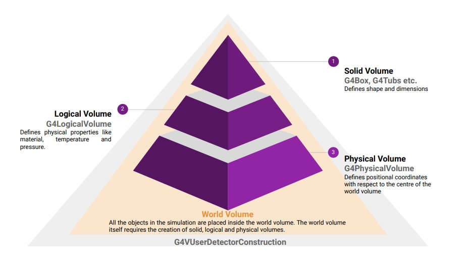

<!--  -->

# **Detector Construction**

EHEP Software School 2024
```29 Jan - 10 Feb 2024```

https://github.com/deepaksamuel/ehep-student-codes.git

---

# Geant4: Mandatory classes

- Detector construction: `G4VUserDetectorConstruction`
- Particle Gun:  `G4VUserPhysicsList`
- Physics List: `G4VUserPrimaryGeneratorAction`

Classes with `G4V` prefixes are **abstract** classes: 

-  objects cannot be instantiated directly from these base classes
-  you have to **subclass** them

---

# Detector construction: First goals

- Detector construction: `G4VUserDetectorConstruction`
    - how to subclass
    - implement the virtual methods
    - build 
        - world
        - solid 
        - logic 
        - physical volumes


---

# Running the first example: A simple box


- source the `geant.sh` file: 
    - On my computer:
    - `source /snap/gate/42/usr/local/bin/geant4.sh`

- Create a `build` folder in the same location as `box`

- inside the `build` folder run:
    - `cmake ../box`
    - `make`
    - `./exampleB1 `
> All the above commands should be executed in the same terminal session where the `geant4.sh` was sourced!
---
# Visualization


---
# Subclassing

> Example: `box/include/DetectorConstruction.hh`

```c
class DetectorConstruction : public G4VUserDetectorConstruction
{
  public:
    DetectorConstruction();
    ~DetectorConstruction() override;

    G4VPhysicalVolume* Construct() override;

    G4LogicalVolume* GetScoringVolume() const { return fScoringVolume; }

  protected:
    G4LogicalVolume* fScoringVolume = nullptr;
};
```
> We need to implement the virtual method `Construct` that should return a pointer to a ```G4VPhysicalVolume``` 


---

# Volume hierarchy in Geant4



---
# Implementing the world volume

###### `box/src/DetectorConstruction.cc`
```c
G4VPhysicalVolume* DetectorConstruction::Construct()
{
  // Get nist material manager
  G4NistManager* nist = G4NistManager::Instance();
  
  G4Material* world_mat = nist->FindOrBuildMaterial("G4_AIR"); // the world volume is Air
  G4Material* box_mat = nist->FindOrBuildMaterial("G4_WATER");

  // Option to switch on/off checking of volumes overlaps
  //
  G4bool checkOverlaps = true;

  // construct a world volume box of dimensions 30 cm x 30 cm x 30 cm
  G4Box* solidWorld =  new G4Box("World", 15*cm, 15*cm, 15*cm);     //Solid Volume Note convention: Half length is used
  G4LogicalVolume* logicWorld =   new G4LogicalVolume(solidWorld, world_mat,"World");            //Logical Volume its name
  // Physical volume
  G4VPhysicalVolume* physWorld =
    new G4PVPlacement(0,                     //no rotation
                      G4ThreeVector(),       //at (0,0,0)
                      logicWorld,            //its logical volume
                      "World",               //its name
                      0,                     //its mother  volume
                      false,                 //no boolean operation
                      0,                     //copy number
                      checkOverlaps);        //overlaps checking
```
- The mother volume of the mother volume is null
---

# Implementing the box

###### `box/src/DetectorConstruction.cc`

```c
 // Big box: construct a water box of dimensions 20 cm x 20 cm x 20 cm
//   G4Box* solidBox =  new G4Box("Box", 10*cm, 10*cm, 10*cm);     //Note convention: Half length is used
  G4Tubs* solidBox = G4Tubs("Tube", 3*cm,  3.1*cm,  5*cm);
  G4LogicalVolume* logicBox =   new G4LogicalVolume(solidBox, box_mat,"Box");            //its name
  // rotation not mandatory
  G4RotationMatrix* rotation = new G4RotationMatrix();
  rotation->rotateX(0*deg);
  rotation->rotateY(0*deg);
  rotation->rotateZ(0*deg);
  
  G4VPhysicalVolume* physBox =
                      new G4PVPlacement(rotation,     // rotation matrix
                      G4ThreeVector(0,0,0),      //at // translation
                      logicBox,             //its logical volume
                      "Box",                 //its name
                      logicWorld,            //its mother  volume
                      false,                 //no boolean operation
                      0,                     //copy number
                      checkOverlaps);        //overlaps checking
```
- Mother volume of all other volumes should be the mother volumes or any other volumes
---
# Construct() returns the physical volume of world

```c  
G4VPhysicalVolume* DetectorConstruction::Construct()
{
    ....
    ....
    ....
  //always return the physical World
  return physWorld;
}
  ```
---
# Exercise 1: A smaller box inside a box (5 cm all sides)

> Modify the previous example: implement Solid, Logical and Physical Volumes
---

# Exercise 2: A smaller box inside a box (5 cm all sides)

> Modify the previous example: implement Solid, Logical and Physical Volumes

- Move the bigger box by 5 cm: 
    - Observe if the smaller box which was inside it has also moved

- Make the mother volume of the smaller box as `logicBox` instead of `logicWorld`
    - Observe if the smaller box has moved now
---
> Material Database:
https://www.fe.infn.it/u/paterno/Geant4_tutorial/slides_further/Geometry/G4_Nist_Materials.pdf

> Shapes:
https://geant4-userdoc.web.cern.ch/UsersGuides/ForApplicationDeveloper/html/Detector/Geometry/geomSolids.html#solids

---
# Exercise 3: Two orthogonal tubes


  
`  G4Tubs* solidTube = new G4Tubs("Tube", 3*cm,  3.1*cm,  5*cm, 0 ,360*deg);`

---
# Boolean Solids


---
# Demo in boolean folder

> `boolean/src/DetectorConstruction.cc`

```c
    G4Box *box = new G4Box("Box", 20 * mm, 30 * mm, 40 * mm);
    G4Tubs *cyl = new G4Tubs("Cylinder", 0 * mm, 15 * mm, 42 * mm, 0, 2 * CLHEP::pi); // rmin=0;rmax=15 mm; len=40mm and phi from 0 to 2pi
    // A cylider is subtracted from a box
    G4SubtractionSolid *subtraction = new G4SubtractionSolid("Box-Cylinder", box, cyl); //solid
    G4LogicalVolume* logicBox =   new G4LogicalVolume(subtraction, box_mat,"Box-Cylinder");  // logic

    // physical volume
    G4VPhysicalVolume *physBox =
        new G4PVPlacement(0,                      // rotation matrix
                          G4ThreeVector(0, 0, 0), // at // translation
                          logicBox,               // its logical volume
                          "Box-Cylinder",         // its name
                          logicWorld,             // its mother  volume
                          false,                  // no boolean operation
                          0,                      // copy number
                          checkOverlaps);         // overlaps checking

```

---
# Exercise 6:

One can also perform translations and rotations on one of the solids before subtraction. The following shows how to rotate the cylinder by 45 degrees before subtraction.
```c
    G4RotationMatrix* yRot = new G4RotationMatrix;  // Rotates X and Z axes only
    yRot->rotateY(M_PI/4.*rad);                     // Rotates 45 degrees
    G4ThreeVector zTrans(0, 0, 50*mm);
    G4SubtractionSolid* subtraction =   new G4SubtractionSolid("Box-Cylinder", box1, cyl,yRot,zTrans);
    G4LogicalVolume* logicBox =   new G4LogicalVolume(subtraction, box_mat,"Box-Cylinder");
     
  ```
Check how the object looks like now.

---

# Exercise 6:

- Create two holes in the box, each orthogonal to each other

>  https://github.com/deepaksamuel/ehep-2024-instructors.git
---


# Exercise 7: A GEM foil

- Make a 10 cm x 10 cm copper foil of thickness 1 mm with holes of diameter 70 um placed in a grid like distribution with pitch of 140 um.


https://vanderby.web.cern.ch/dem/products/gem/


---
# Exercise 8: Building a RPC

- List down all components that you see in the detector and note down their:
  - Dimensions
  - Materials
  - Positioning 

- Split into teams of 5, with each member writing the code for one of the components

- Finally merge all the components together in a single file

---